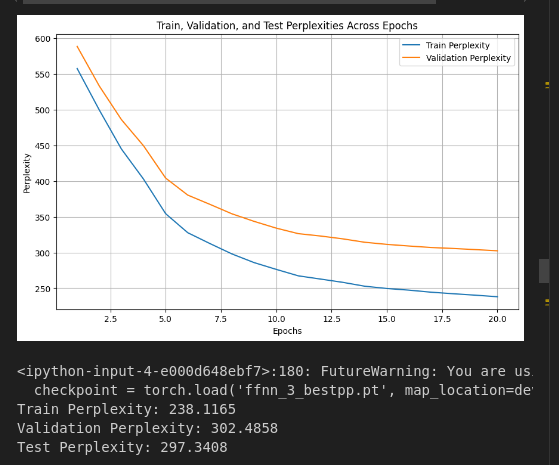
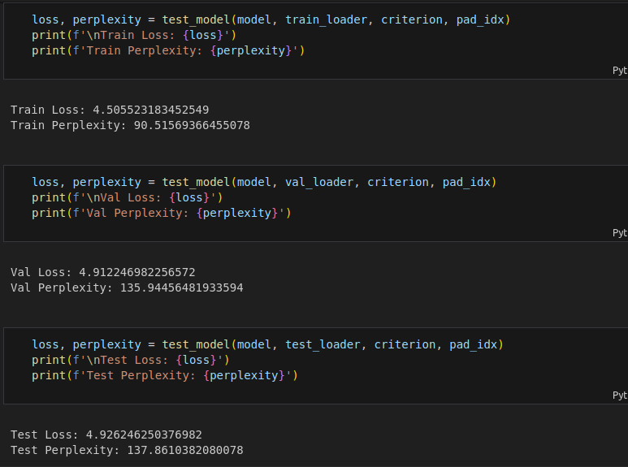

# Next Word Prediction using FFNN, RNN, and LSTM

## Overview

This project implements and compares different language models (FFNN, RNN, LSTM) for next-word prediction. The models are trained on two datasets:

- **Pride and Prejudice**
- **Ulysses**

Each model is evaluated based on perplexity and generalization performance.

## Project Structure

```
📂 Project Root
│── generator.ipynb  # Loads the required model and predicts the next word
│── FFNN_pp.ipynb    # Trains FFNN model on Pride and Prejudice (n=3,5)
│── FFNN_u.ipynb     # Trains FFNN model on Ulysses (n=3,5)
│── lstmpp.ipynb    # Trains LSTM model on Pride and Prejudice
│── lstm_u.ipynb     # Trains LSTM model on Ulysses
│── rnnpp.ipynb     # Trains RNN model on Pride and Prejudice
│── rnn_u.ipynb      # Trains RNN model on Ulysses
```

---

## **Model Implementations**

### **Feedforward Neural Network (FFNN)**

- Implemented for **n-grams (n=3,5)**
- Architecture:
  - Input layer: Tokenized context words converted to embeddings
  - Hidden layers: Fully connected layers with ReLU activations
  - Output layer: Softmax over vocabulary to predict the next word
- Training:
  - Optimizer: Adam
  - Loss: Cross-entropy loss

#### **Observations:**

- **FFNN (n=3) on Ulysses is overfitting**, requiring regularization techniques.
- **Perplexity: FFNN > RNN > LSTM**

---

### **Recurrent Neural Network (RNN)**

- Implemented using a standard **Elman RNN**
- Uses **GloVe embeddings** for input representation
- Architecture:
  - Input layer: Tokenized context words converted to embeddings
  - Recurrent layer: Simple RNN with tanh activation
  - Fully connected layer with softmax activation
- Training:
  - Optimizer: Adam
  - Loss: Cross-entropy loss

#### **Observations:**

- Performs better than FFNN but worse than LSTM in perplexity.
- More stable than FFNN on Ulysses dataset.

---

### **Long Short-Term Memory (LSTM)**

- Implemented with **GloVe embeddings**
- Uses LSTM cells to capture long-range dependencies
- Architecture:
  - Input layer: Tokenized context words converted to embeddings
  - LSTM layer: Multi-layer LSTM with dropout
  - Fully connected layer with softmax activation
- Training:
  - Optimizer: Adam
  - Loss: Cross-entropy loss

#### **Observations:**

- **Best performance in terms of perplexity**
- **LSTM on Ulysses overfits**, indicating a need for dropout and regularization.

---

## **How to Run**

### **1. Load the Models in Google Colab**

1. Open **Generator.ipynb** in Google Colab.
2. Mount Google Drive to access saved models:
   ```python
   from google.colab import drive
   drive.mount('/content/drive')
   ```
3. Load the required model:
   ```python
   model_path= "https://drive.google.com/drive/folders/1908ZxuAKv_F4bdLTP8qdeiAaO9WHeN42?usp=sharing"
   <!-- Link to google drive saved models -->
   model = torch.load(model_path, map_location=torch.device('cpu'))
   ```

## **Screenshots of Results**

### FFNN N=3 Pride and prejudice



### FFNN N=5 Pride and prejudice


### FFNN N=3 Ulysses


### FFNN N=5 Ulysses


### RNN Pride and Prejudice


### RNN Ulysses


### LSTM Pride and Prejudice




### LSTM Ulysses


---

## **Observation:**

> - **Perplexity: FFNN > RNN > LSTM**
> - **Pride and Prejudice has lower perplexity than Ulysses.**
> - **LSTM on Ulysses and FFNN (n=3) on Ulysses show overfitting.**

---

## **Conclusion**

- **LSTM performs best in terms of perplexity.**
- **RNN provides a balance between performance and complexity.**
- **FFNN struggles with generalization, especially for Ulysses.**
- **Regularization needed for LSTM on Ulysses and FFNN (n=3) on Ulysses.**